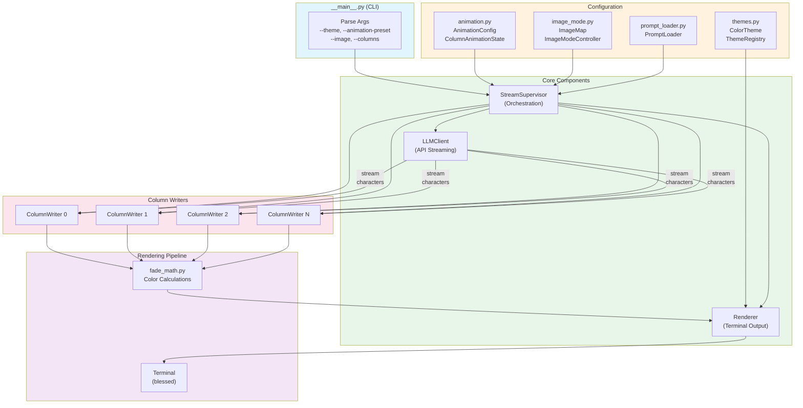

# Matrix Rain TUI

A Python-based Terminal User Interface for visualizing high-throughput LLM streaming in a Matrix-style rain effect.

**Current Version:** 0.0.3 (Themes, Animation & Image Mode)

## Overview

Matrix Rain TUI provides a real-time visualization of concurrent LLM streaming operations, displaying them as falling characters in the style of the Matrix movie. The application supports multiple concurrent streams with multilingual prompts, creating a dynamic and visually appealing demonstration of AI capabilities across different languages and topics.

## Architecture

```
┌─────────────────────────────────────────────────────────────────────────────┐
│                              __main__.py                                     │
│                         (CLI Entry Point)                                    │
│  Parses args: --theme, --animation-preset, --image, --columns, etc.        │
└─────────────────────────────────┬───────────────────────────────────────────┘
                                  │
                                  ▼
┌─────────────────────────────────────────────────────────────────────────────┐
│                           StreamSupervisor                                   │
│                      (Orchestration Layer)                                   │
│                                                                              │
│  ┌──────────────┐  ┌──────────────┐  ┌──────────────┐  ┌──────────────┐    │
│  │ LLMClient    │  │ Renderer     │  │ Animation    │  │ Image        │    │
│  │              │  │ (+ Theme)    │  │ Config       │  │ Controller   │    │
│  └──────┬───────┘  └──────┬───────┘  └──────┬───────┘  └──────┬───────┘    │
│         │                 │                 │                 │             │
│         │    Streams LLM  │   Draws to      │  Controls       │  Modulates  │
│         │    responses    │   terminal      │  timing/effects │  brightness │
│         ▼                 ▼                 ▼                 ▼             │
│  ┌──────────────────────────────────────────────────────────────────────┐  │
│  │                         ColumnWriter[]                                │  │
│  │                    (Per-Column Rendering)                             │  │
│  │                                                                       │  │
│  │   Col 0    Col 1    Col 2    Col 3    Col 4    ...    Col N          │  │
│  │    ▼        ▼        ▼        ▼        ▼              ▼              │  │
│  │   ┌─┐      ┌─┐      ┌─┐      ┌─┐      ┌─┐            ┌─┐             │  │
│  │   │A│      │ｱ│      │Б│      │中│      │@│            │#│             │  │
│  │   │B│      │ｲ│      │В│      │文│      │$│            │%│             │  │
│  │   │C│      │ｳ│      │Г│      │字│      │&│            │^│             │  │
│  │   │ │      │ │      │ │      │ │      │ │            │ │             │  │
│  │   └─┘      └─┘      └─┘      └─┘      └─┘            └─┘             │  │
│  │    │        │        │        │        │              │              │  │
│  │    └────────┴────────┴────────┴────────┴──────────────┘              │  │
│  │                         ▼                                             │  │
│  │              ┌─────────────────────┐                                  │  │
│  │              │     fade_math.py    │                                  │  │
│  │              │  (Color Fade Calc)  │                                  │  │
│  │              └─────────────────────┘                                  │  │
│  └──────────────────────────────────────────────────────────────────────┘  │
└─────────────────────────────────────────────────────────────────────────────┘

┌─────────────────────────────────────────────────────────────────────────────┐
│                           Supporting Modules                                 │
├─────────────────┬─────────────────┬─────────────────┬───────────────────────┤
│   themes.py     │  animation.py   │  image_mode.py  │   prompt_loader.py    │
├─────────────────┼─────────────────┼─────────────────┼───────────────────────┤
│ ColorTheme      │ AnimationConfig │ ImageMap        │ PromptLoader          │
│ ThemeRegistry   │ ColumnAnim-     │ ImageMode-      │ (YAML prompts)        │
│                 │   State         │   Controller    │                       │
│ Presets:        │ Presets:        │                 │ Languages:            │
│ - classic       │ - calm          │ Features:       │ - en, zh, ja, ko      │
│ - nvidia        │ - default       │ - brightness    │ - ru, th, fr, de, it  │
│ - amber         │ - intense       │   mapping       │                       │
│ - cyan          │ - chaos         │ - column        │                       │
│ - hacker        │                 │   activity      │                       │
│ - purple        │ Features:       │ - position      │                       │
│ - fire          │ - fall speed    │   modulation    │                       │
│ - ice           │ - trail length  │                 │                       │
│ - blood         │ - flash effects │                 │                       │
│ - gold          │ - char mutation │                 │                       │
│                 │ - density ctrl  │                 │                       │
└─────────────────┴─────────────────┴─────────────────┴───────────────────────┘

Data Flow:
──────────
1. User runs CLI with options (theme, animation, image, columns)
2. StreamSupervisor initializes Renderer with theme colors
3. For each column: ColumnWriter created with animation state
4. LLMClient streams responses → characters fed to ColumnWriters
5. Fade renderer (60fps) updates colors based on:
   - Theme colors (head_fg, trail_fg, background)
   - Animation state (flash, mutation, trail length)
   - Image brightness (if image mode enabled)
6. blessed library renders to terminal
```

### Mermaid Diagram



## Setup Options

### Option A — Local Development (uv + .venv)

**Use case:** Direct development on host system (Mac, Ubuntu, etc.)

#### Requirements

- Python 3.11+
- [uv](https://github.com/astral-sh/uv) installed globally

#### Steps

1. Clone the repository:
   ```bash
   git clone <repository-url>
   cd llm-matrix-tui
   ```

2. Create `.env` from sample:
   ```bash
   cp .env.sample .env
   ```

3. Sync dependencies:
   ```bash
   uv sync
   ```

4. Run the application:
   ```bash
   uv run python -m matrix_tui
   ```

5. Run tests:
   ```bash
   uv run pytest
   ```

6. Format code:
   ```bash
   make black
   ```

### Option B — Containerized (Docker / Docker Compose)

**Use case:** Ensure consistent environment and easier portability.

#### Using Docker Compose (Recommended)

```bash
# Build and run
docker compose up --build

# Run in background
docker compose up -d --build
```

#### Using Docker directly

```bash
# Build the image
docker build -t matrix-tui .

# Run the container
docker run -it --env-file .env matrix-tui
```

## Commands Summary

| Command | Description |
|---------|-------------|
| `uv run python -m matrix_tui` | Run the application locally |
| `make black` | Format all Python code |
| `uv run pytest` | Run tests |
| `make test` | Run tests (alternative) |
| `make run` | Run application (alternative) |
| `make install` | Install dependencies |
| `make clean` | Clean up build artifacts |
| `docker compose up --build` | Build and run with Docker Compose |

## Testing New Features

### Theme System

```bash
# List all available themes
uv run python -m matrix_tui --list-themes

# Run with classic Matrix green theme
uv run python -m matrix_tui -c 5 --theme classic

# Run with amber retro terminal theme
uv run python -m matrix_tui -c 5 --theme amber

# Run with fire theme (yellow head, orange-red trail)
uv run python -m matrix_tui -c 5 --theme fire

# Available themes: classic, nvidia, amber, cyan, hacker, purple, fire, ice, blood, gold
```

### Animation Presets

```bash
# Calm preset - slow, sparse, minimal effects
uv run python -m matrix_tui -c 10 --animation-preset calm

# Intense preset - fast, dense, frequent effects
uv run python -m matrix_tui -c 10 --animation-preset intense

# Chaos preset - maximum randomness and effects
uv run python -m matrix_tui -c 10 --animation-preset chaos

# Custom animation settings
uv run python -m matrix_tui -c 10 --fall-speed 0.3,3.0 --flash-prob 0.05 --mutation-prob 0.02

# Dense columns with intense effects
uv run python -m matrix_tui -c 20 --density 0.8 --animation-preset intense
```

### Image Visualization Mode

```bash
# Display an image through the rain effect (sample image included in repo)
uv run python -m matrix_tui -c 40 --image src/matrix.jpg

# Image mode with custom threshold (lower = more active columns)
uv run python -m matrix_tui -c 40 --image src/matrix.jpg --image-threshold 0.1

# Inverted image mode (dark areas become bright)
uv run python -m matrix_tui -c 40 --image src/matrix.jpg --image-invert
```

### Combining Features

```bash
# Fire theme with intense animation
uv run python -m matrix_tui -c 15 --theme fire --animation-preset intense

# Ice theme with calm animation
uv run python -m matrix_tui -c 10 --theme ice --animation-preset calm

# Image mode with purple theme
uv run python -m matrix_tui -c 40 --image src/matrix.jpg --theme purple

# Full combination: theme + animation + custom settings
uv run python -m matrix_tui -c 20 --theme hacker --animation-preset intense --density 0.7
```

## Configuration

Copy `.env.sample` to `.env` and modify the values as needed:

```env
OPENAI_BASE_URL=http://localhost:8000
OPENAI_API_KEY=sk-local-1234
OPENAI_MODEL=llama-3.1-8b-instruct
```

Docker Compose will automatically load the `.env` file.

### Example LLM endpoint (vLLM + Nemotron)

Reference command for the local OpenAI-compatible server this project is
currently developed against — vLLM serving NVIDIA's Nemotron-3-Nano-Omni
reasoning model. Note that this is a **reasoning model**: `llm.py` forwards
both `delta.reasoning` and `delta.content`, so thinking tokens also flow
into the rain visualization.

```bash
docker run -it \
  --rm \
  --pull always \
  --name vllm-nemotron \
  --runtime=nvidia \
  --network host \
  -p 8000:8000 \
  --ipc=host \
  -v $HOME/.cache/huggingface:/root/.cache/huggingface \
  -e VLLM_FLASHINFER_MOE_BACKEND=latency \
  --entrypoint bash vllm/vllm-openai:nightly \
  -c "pip install -q nvidia-cuda-runtime-cu12 'vllm[audio]' && \
        export LD_LIBRARY_PATH=/usr/local/lib/python3.12/dist-packages/nvidia/cuda_runtime/lib:\$LD_LIBRARY_PATH && \
        vllm serve nvidia/Nemotron-3-Nano-Omni-30B-A3B-Reasoning-NVFP4 \
        --served-model-name nvidia/Nemotron-3-Nano-Omni-30B-A3B-Reasoning-NVFP4 nemotron-3-nano-omni \
        --tensor-parallel-size 1 \
        --port 8000 --host 0.0.0.0 \
        --max-model-len 131072 \
        --max-num-seqs 16 \
        --max-num-batched-tokens 8192 \
        --gpu-memory-utilization 0.85 \
        --quantization fp4 \
        --moe-backend marlin \
        --kv-cache-dtype fp8 \
        --mamba-ssm-cache-dtype float32 \
        --enable-prefix-caching \
        --reasoning-parser nemotron_v3 \
        --enable-auto-tool-choice \
        --tool-call-parser qwen3_coder \
        --video-pruning-rate 0.5 \
        --limit-mm-per-prompt '{\"video\":1,\"image\":1,\"audio\":1}' \
        --media-io-kwargs '{\"video\":{\"fps\":2,\"num_frames\":256}}' \
        --allowed-local-media-path / \
        --trust-remote-code"
```

Matching `.env`:

```env
OPENAI_BASE_URL=http://localhost:8000/v1
OPENAI_API_KEY=none
OPENAI_MODEL=nemotron-3-nano-omni
```

`--max-num-seqs 16` is the server-side concurrency cap — running more
matrix-tui columns than this means streams will queue. Match `--columns`
to (or below) `--max-num-seqs` for full parallelism.

#### Argument reference

**Docker flags**

- `-it` — allocate a TTY and keep stdin open (so Ctrl-C reaches vLLM).
- `--rm` — remove the container on exit; no leftover stopped containers.
- `--pull always` — always pull the image before starting (catches nightly updates).
- `--name vllm-nemotron` — fixed name so you can `docker logs vllm-nemotron`.
- `--runtime=nvidia` — use the NVIDIA Container Runtime so the container sees the GPU.
- `--network host` — share the host network namespace; avoids Docker's NAT overhead and gives full bandwidth.
- `-p 8000:8000` — port publish; redundant under `--network host` but kept as documentation.
- `--ipc=host` — share host's IPC namespace; required for PyTorch shared-memory between vLLM's worker processes (otherwise you'll see "bus error" or shared-memory exhaustion).
- `-v $HOME/.cache/huggingface:/root/.cache/huggingface` — mount your HF cache so model weights persist between container restarts (otherwise it re-downloads on every run).
- `-e VLLM_FLASHINFER_MOE_BACKEND=latency` — pick FlashInfer's latency-optimized MoE kernels over the throughput-optimized variant.
- `--entrypoint bash` + `-c "..."` — override the image entrypoint to run a multi-step bash command (install extra packages, then start vLLM).

**Container startup**

- `pip install -q nvidia-cuda-runtime-cu12 'vllm[audio]'` — installs the audio extras and CUDA runtime libs at container start (the base image doesn't include them).
- `export LD_LIBRARY_PATH=...` — points the dynamic linker at the freshly-installed CUDA runtime libs.

**vLLM model & API flags**

- `nvidia/Nemotron-3-Nano-Omni-30B-A3B-Reasoning-NVFP4` — HF model ID. 30B parameters total, MoE with ~A3B active params, NVFP4-quantized weights, reasoning-trained, omni (text+image+video+audio).
- `--served-model-name X Y` — API aliases the model can be requested as (full HF id and the short `nemotron-3-nano-omni`). Either string works in `OPENAI_MODEL`.
- `--tensor-parallel-size 1` — split weights across N GPUs (1 = single GPU).
- `--port 8000 --host 0.0.0.0` — listen address.
- `--trust-remote-code` — allow loading custom Python code from the model repo (Nemotron ships custom modeling files).

**Memory & throughput knobs**

- `--max-model-len 131072` — max context length (prompt + output) per request. **Largest single lever for concurrency** — see "Tuning" below.
- `--max-num-seqs 16` — max concurrent sequences the scheduler will run. Cap on parallel streams.
- `--max-num-batched-tokens 8192` — max total tokens (across all running seqs) processed per forward pass. Constrains how big a prefill batch can be.
- `--gpu-memory-utilization 0.85` — fraction of GPU memory vLLM may use (weights + KV cache + activations + CUDA-graph workspace).
- `--quantization fp4` — weight quantization, 4-bit. Already baked into NVFP4 checkpoints.
- `--moe-backend marlin` — MoE GEMM kernel; Marlin is the fast quantized-MoE path.
- `--kv-cache-dtype fp8` — store KV cache as fp8 (~half the memory of bf16) — already big concurrency win.
- `--mamba-ssm-cache-dtype float32` — Nemotron is hybrid attention+Mamba; this is the dtype for Mamba's state-space cache.
- `--enable-prefix-caching` — cache KV blocks for shared prompt prefixes; large speedup when many requests share a system prompt (true for matrix-tui).

**Reasoning & tools**

- `--reasoning-parser nemotron_v3` — parses the model's `<thinking>`-style output into the OpenAI streaming response's `delta.reasoning` field. `llm.py` forwards both `delta.reasoning` and `delta.content` so thinking tokens animate too.
- `--enable-auto-tool-choice` — auto-detects tool/function calls in the output stream.
- `--tool-call-parser qwen3_coder` — which parser format to use when extracting tool calls.

**Multimodal (irrelevant to matrix-tui — text-only)**

- `--video-pruning-rate 0.5` — drop 50% of video tokens before attention.
- `--limit-mm-per-prompt '{"video":1,"image":1,"audio":1}'` — max multimodal items per prompt.
- `--media-io-kwargs '{"video":{"fps":2,"num_frames":256}}'` — video decoding params (sample at 2 fps, max 256 frames).
- `--allowed-local-media-path /` — directories from which `file://` media URIs may be loaded. **Security note**: `/` is permissive — fine on a local single-user machine, tighten for shared/exposed deployments.

#### Tuning concurrency (max-num-seqs)

vLLM logs the theoretical concurrency ceiling on startup. Look for:

```
GPU KV cache size: 20,997,734 tokens
Maximum concurrency for 131,072 tokens per request: 160.20x
```

That's the formula: `max_concurrent ≈ KV_cache_tokens ÷ max_model_len`.

The dominant lever is `--max-model-len`: drop it and concurrency rises linearly.
For matrix-tui, prompts are ~50–200 tokens and replies are capped at 200
(`max_tokens=200` in `llm.py`), so 4096 is plenty.

Suggested matrix-tui-tuned config:

```
--max-model-len 4096                # was 131072 — 32× more KV headroom
--max-num-seqs 64                   # was 16 — match higher headroom
--max-num-batched-tokens 16384      # was 8192 — handle bigger prefill batches
--gpu-memory-utilization 0.92       # was 0.85 — squeeze ~10% more KV
# keep --enable-prefix-caching and --kv-cache-dtype fp8
```

Caveat: the theoretical max isn't the *useful* max. Per-stream throughput
drops as concurrency rises (shared compute), and the matrix rain only needs
~32–64 streams to saturate the screen visually. Going much higher mostly
wastes GPU.

## Prompts Configuration

The application uses a `prompts.yml` file to define multilingual prompts that are randomly selected for each streaming column. This allows for diverse, multilingual content generation.

### Prompts File Structure

The `prompts.yml` file contains a list of prompts with the following structure:

```yaml
prompts:
  - prompt: "Your user prompt here"
    system_prompt: "You are a helpful assistant. Please answer in [language]."
    lang: "en"  # Language code (ISO 639-1)
```

### Supported Languages

The default prompts file includes prompts in multiple languages:
- **English (en)** - 20 prompts covering AI, technology, science, and philosophy
- **Chinese (zh)** - 20 prompts in Simplified Chinese
- **Japanese (ja)** - 20 prompts in Japanese
- **Korean (ko)** - 20 prompts in Korean
- **Russian (ru)** - 20 prompts in Russian
- **Thai (th)** - 20 prompts in Thai
- **French (fr)** - 20 prompts in French
- **German (de)** - 20 prompts in German
- **Italian (it)** - 20 prompts in Italian

### Using Custom Prompts

You can specify a custom prompts file using the `--prompts` or `-p` argument:

```bash
# Use a custom prompts file
uv run python -m matrix_tui --prompts my_custom_prompts.yml

# Run with multiple columns and custom prompts
uv run python -m matrix_tui --columns 5 --prompts multilingual_prompts.yml
```

### Creating Your Own Prompts

To create your own prompts file:

1. Create a new YAML file (e.g., `my_prompts.yml`)
2. Follow the structure shown above
3. Add as many prompts as you want
4. Use standard ISO 639-1 language codes for the `lang` field
5. Ensure each prompt has a corresponding system prompt that instructs the AI to respond in the target language

Example custom prompts file:
```yaml
prompts:
  - prompt: "Explain quantum physics in simple terms"
    system_prompt: "You are a helpful physics tutor. Please answer in English."
    lang: "en"
  - prompt: "¿Cómo funciona la fotosíntesis?"
    system_prompt: "Eres un asistente útil. Por favor responde en español."
    lang: "es"
```

### Fallback Behavior

If the prompts file cannot be loaded or is invalid, the application will fall back to a set of default English prompts to ensure the application continues to function.

## Project Structure

```
matrix-tui/
├── src/
│   ├── matrix.jpg            # Sample image for image mode
│   └── matrix_tui/
│       ├── __init__.py
│       ├── __main__.py       # CLI entry point
│       ├── animation.py      # Animation config & presets
│       ├── config.py         # Environment config
│       ├── fade_math.py      # Color fade calculations
│       ├── image_mode.py     # Image visualization mode
│       ├── llm.py            # LLM client
│       ├── prompt_loader.py  # YAML prompt loading
│       ├── renderer.py       # Terminal rendering
│       ├── supervisor.py     # Stream orchestration
│       ├── themes.py         # Color themes
│       └── vertical_column.py # Per-column rendering
├── tests/
│   ├── test_animation.py     # Animation tests
│   ├── test_image_mode.py    # Image mode tests
│   ├── test_themes.py        # Theme tests
│   └── test_*.py             # Other tests
├── prompts.yml
├── .env.sample
├── .gitignore
├── .dockerignore
├── Dockerfile
├── docker-compose.yml
├── Makefile
├── pyproject.toml
└── README.md
```

## Development

### Dependencies

- **Core:** `python-dotenv` for environment variable loading, `openai` for LLM API access, `blessed` for terminal UI, `pyyaml` for prompts configuration, `Pillow` for image visualization mode
- **Development:** `pytest` for testing, `black` for code formatting

### Code Formatting

This project uses Black for code formatting with the following configuration:
- Line length: 88 characters
- Target Python version: 3.11+

### Testing

Tests are located in the `tests/` directory and can be run with:
```bash
uv run pytest
```

## Features

### Core Features
- **Multilingual Support**: Prompts in 9 different languages (English, Chinese, Japanese, Korean, Russian, Thai, French, German, Italian)
- **Concurrent Streaming**: Support for multiple parallel LLM streams (up to terminal width)
- **Random Prompt Selection**: Each column gets a unique, randomly selected prompt
- **Customizable Prompts**: Easy-to-use YAML configuration for prompts
- **Terminal UI**: Beautiful Matrix-style falling character visualization
- **Docker Support**: Containerized deployment options
- **Robust Error Handling**: Fallback prompts ensure continuous operation

### Theme System
- **10 Built-in Themes**: classic, nvidia, amber, cyan, hacker, purple, fire, ice, blood, gold
- **Custom Themes**: Load custom themes from JSON files
- **Theme Listing**: View all available themes with `--list-themes`

### Animation Effects
- **4 Animation Presets**: calm, default, intense, chaos
- **Variable Fall Speeds**: Each column has randomized speed
- **Flash Effects**: Occasional bright flashes on characters
- **Character Mutation**: Characters randomly change as they age (Matrix-style)
- **Density Control**: Control what fraction of columns are active
- **Configurable Trail Length**: Adjust fade trail length

### Image Visualization Mode
- **Image-to-Rain Mapping**: Display images through the rain effect (like Neo seeing the Matrix)
- **Brightness Modulation**: Bright image areas = more active, brighter rain
- **Activity Threshold**: Control minimum brightness for column activity
- **Invert Mode**: Swap bright and dark areas

## Next Steps

Future enhancements may include:
- Additional language support
- Prompt categories and filtering
- Performance optimizations
- Configuration UI
- Audio-reactive mode
- Custom theme editor

## License

MIT License - see LICENSE file for details.
